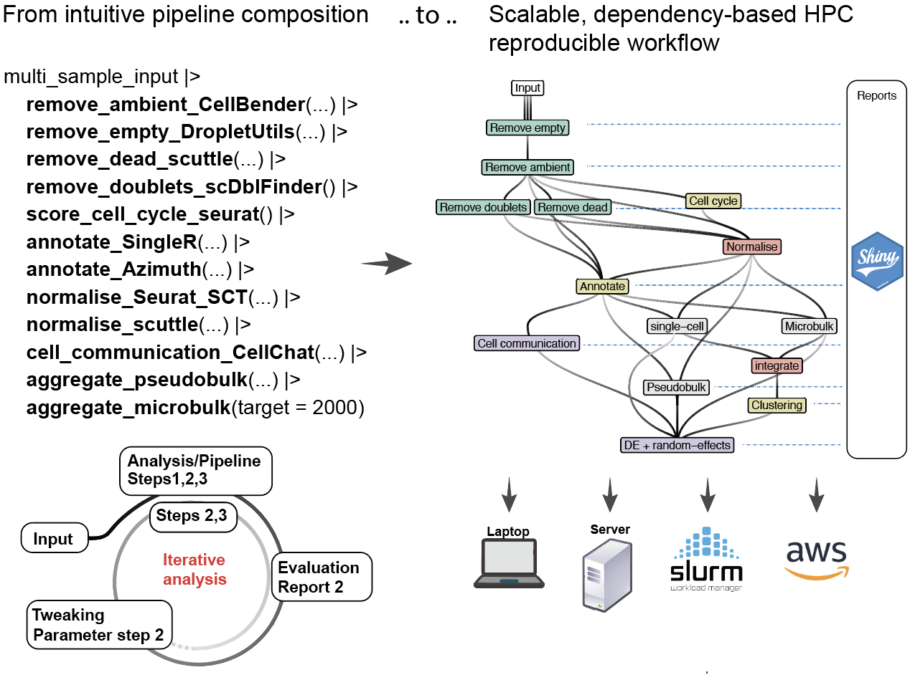

HPCell
================

Compose single-cell and spatial analyses with pipes (\|\>) and leave
HPCell scale them on high-performance and cloud, or locally.

HPCell is a grammar and workflow composer that allows to compose
pipe-friendly single-cell and spatial pipelines, that are converted to
fully integrated, dependency-based parallelised workflow, that can be
easily deployed to HPC with no setup, and easily to cloud-computing.



The advent of advanced sequencing techniques, such as microfluidic,
microwell, droplet-based methodologies, and spatial transcriptomics
technologies, has significantly transformed the study of biological
systems. These advancements have resulted in extensive human and mouse
cell compendiums, necessitating scalable analysis pipelines for
large-scale data. Single-cell RNA-seq pipelines, including Nextflow and
Snakemake, provide robust solutions but require extensive customisation
and scripting. Graphical workflow systems like Galaxy and KNIME, while
user-friendly, often lack the scalability needed for large datasets.
With tools like Bioconductor, Seurat, scater, and others, the R
ecosystem offers comprehensive solutions for single-cell RNA sequencing
analysis but faces limitations in parallelisation efficiency. The
targets R ecosystem addresses these challenges by offering an
integrated, high-performance, cloud-compatible solution that optimises
computational resources and enhances workflow robustness. We introduce
HPCell, a modular grammar based on tidy principles, utilising targets to
parallelise single-cell and spatial R workflows efficiently. HPCell
simplifies workflow management, improves scalability and
reproducibility, and generates visual reports for enhanced data
interpretability, significantly accelerating scientific discovery in the
single-cell RNA sequencing community.

The key features of HPCell include:

- **Native R Pipeline:** HPCell is developed to work natively within the
  R environment, enhancing usability for R users without requiring them
  to learn new, workflow-specific languages.

- **High Performance Computing Support:** HPCell supports scaling for
  large datasets and enables parallel processing of tasks on High
  Performance Computing platforms.

- **Reproducibility and Consistency:** The framework ensures
  reproducibility and consistent execution environments through
  automatic dependency generation.

## Installation

``` r
remotes::install_github("MangiolaLaboratory/HPCell")
```

## The input

The pipeline accepts a vector of file paths. If this vector is named,
those names will be used for the reports. HPCell accepts a variety of
data containers, including on-disk (which we recomend).

- seurat_rds
- seurat_h5
- sce_rds
- anndata
- sce_hdf5

``` r
library(Seurat)
library(SeuratData)

options(Seurat.object.assay.version = "v5")
input_seurat <- 
  LoadData("pbmc3k") |>
  _[,1:500] 

file_path = "~/temp_seurat.rds"

input_seurat |> saveRDS(file_path)

# Let's pretend we have two samples
input_hpc =  c(file_path, file_path, file_path) 
```

## Pipeline

The power of HPCell is that despite you can compose your pipeline simply
using the pipe (\|\>), it is evaluated as a dependency graph by `target`
workflow manager. This has several advantages:

- It has automatic report rendering for each step
- It can parallelise across samples and across steps, improving
  performances. Our provided modules were designed to minimise
  dependencies between analyses. For example, doublet inference and
  reference-based cell annotations are run independently, while the
  filtering happens downstream.
- Our provided medules, never save the whole object if not necessary,
  this optimise the use of on-disk memory. For example, the empty
  droplet, doublet and cell annotation labels, are stored in a data
  frame and integrated downstream, when needed.
- It can accept growing sample set, and runs analyses only on the new
  samples. This is ideal for continuous integration
- It can accept new analysis steps, and just runs the needed
  dependencies
- When parameters of an analysis step are changed (e.g. a threshold),
  `HPCell` only runs the affected dependencies downstream. This is
  helpful when a change of parameters can affect downstream analyses,
  which are re-run automatically
- The pipeline can be easily extended with the modules by the community

``` r
library(HPCell)
library(crew)

input_hpc |> 
  
  # Initialise pipeline characteristics
  initialise_hpc(
    gene_nomenclature = "symbol",
    data_container_type = "seurat_rds"
  ) |> 
  
  remove_empty_DropletUtils() |>          # Remove empty outliers
  remove_dead_scuttle() |>                # Remove dead cells
  score_cell_cycle_seurat() |>            # Score cell cycle
  remove_doublets_scDblFinder() |>        # Remove doublets
  annotate_cell_type() |>                 # Annotation across SingleR and Seurat Azimuth
  normalise_abundance_seurat_SCT(factors_to_regress = c(
    "subsets_Mito_percent", 
    "subsets_Ribo_percent", 
    "G2M.Score"
  )) |> 
  calculate_pseudobulk(group_by = "monaco_first.labels.fine")
```

## Deployment

### Local parallel computing

Your pipeline can be deployed locally using multiple cores. You can
specify the resource allocation as `computing_resources` in
`initialise_hpc()`

``` r
computing_resources = crew_controller_local(workers = 10)
```

### SLURM HPC parallel computing

This resource interfaces with SLURM without the need of complex setups

``` r
library(crew.cluster)

computing_resources =
      crew.cluster::crew_controller_slurm(
        slurm_memory_gigabytes_per_cpu = 5,
        workers = 100, # max 100 jobs at the time are launched to the cluster
        tasks_max = 5 # Shots a worker after 5 tasks.
      )
```

### Resource tiering

For large-scale analyses, where datasets vary in size, using a unique
resource set can be inefficient. For example, few very large datasets
might require 50 Gb of memory, while the majority might only require
5Gb. Asking 50Gb for all jobs would be inefficient (would lead to
maximum usage per user, and limit the parallelisation), while asking 5Gb
would lead to job failure.

You can provide an array of tier labels (of the same length as sample
input vector), and the resources linked with those labels

``` r
# For two samples
input_hpc |> 
  
  # Initialise pipeline characteristics
  initialise_hpc(
    gene_nomenclature = "symbol",
    
    # We have three samples, to which we give two different resources
    data_container_type = "seurat_rds", tier = c("tier_1", "tier_1", "tier_2"), 
    
    # We specify the two resources
    computing_resources = list(

      crew_controller_slurm(
        name = "tier_1",
        slurm_memory_gigabytes_per_cpu = 5,
        workers = 50,
        tasks_max = 5
      ),
      crew_controller_slurm(
        name = "tier_2",
        slurm_memory_gigabytes_per_cpu = 50,
        workers = 10,
        tasks_max = 5
      )
  )
```

## Extend HPCell and create new modules

HPCell offer module constructor that allow users and developers to build
new models on the fly and/or contribute to the ecosystem.

### Simple module

For example, let’s create a toy module, where we normalise the seurat
datasets

``` r
input_hpc |> 
  
  # Initialise pipeline characteristics
  initialise_hpc(
    gene_nomenclature = "symbol",
    data_container_type = "seurat_rds"
  ) |> 
  
  hpc_iterate(
    user_function = NormalizeData |> quote(), # The function, quoted to not be evaluated on the spot
    object = "data_object" |> is_target(), # The argument to the function. `is_target()` declares the dependency.
    # Other arguments that are not a dependency can also be used
    target_output = "seurat_normalised", # The name of the output dependency
    packages = "Seurat" # Software packages needed for the execution
  )

tar_read(seurat_normalised)
```

### Complex module

Now let’s create a more complex module, where we accept both single-cell
experiment and Seurat objects

``` r
input_hpc |> 
  
  # Initialise pipeline characteristics
  initialise_hpc(
    gene_nomenclature = "symbol",
    data_container_type = "seurat_rds"
  ) |> 
  
  hpc_iterate(
    user_function = (function(x){
      
      if(x |> is("SingleCellExperiment"))
        x |> as.Seurat() |> NormalizeData()
      
      else if(x |> is("Seurat"))
        x |> NormalizeData()
      
      else warning("Data format not accepted")
      
    }) |> quote(), # The function, quoted to not be evaluated on the spot
    x = "data_object" |> is_target(), # The argument to the function. `is_target()` declares the dependency.
    target_output = "seurat_normalised", # The name of the output dependency
    packages = "Seurat" # Software packages needed for the execution
  )

tar_read(seurat_normalised)
```

### Reports module

`HPCell` allows you to create reports of any combination of analysis
results, that will be rendered once the necessary analyses will be
completed.

Here we provide a toy example

``` r
input_hpc |> 
  
  # Initialise pipeline characteristics
  initialise_hpc(
    gene_nomenclature = "symbol",
    data_container_type = "seurat_rds"
  ) |> 
  
  hpc_report(
    "empty_report", # The name of the report output
    rmd_path = paste0(system.file(package = "HPCell"), "/rmd/test.Rmd"), # The path to the Rmd. In this case it is stored within the package
    empty_list = "empty_tbl" |> is_target(), # The results and targets needed for the report
    sample_names = "sample_names" |> is_target() # The results and targets needed for the report
  ) 

tar_read(empty_report)
```

## Details on prebuilt steps for several popular methods

### Filtering out empty droplets

*Parameters* 1. input_read_RNA_assay SingleCellExperiment object
containing RNA assay data. 2. filter_empty_droplets Logical value
indicating whether to filter the input data.

We filter empty droplets as they don’t represent cells, but include only
ambient RNA, which is uninformative for our biological analyses.

Outputs `barcode_table` which is a tibble containing log probabilities,
FDR, and a classification indicating whether cells are empty droplets.

This step includes 4 sub steps: Filtering mitochondrial and ribosomal
genes, ranking droplets, identifying minimum threshold and removing
cells with RNA counts below this threshold

``` r
HPCell::empty_droplet_id(input_read, filter_empty_droplets)
```

#### 1. Filtering mitochondrial and ribosomal genes based on EnsDb.Hsapiens.v8 reference dataset

Mitochondrial and ribosomal genes exhibit expression patterns in
single-cell RNA sequencing (scRNA-seq) data that are distinct from the
patterns observed in the rest of the transcriptome. They are filtered
out to improve the quality and interpretability of scRNA-seq data,
focusing the analysis on genes more likely to yield insights

``` r
 # Genes to exclude
location <- AnnotationDbi::mapIds(
  EnsDb.Hsapiens.v86,
  keys= BiocGenerics::rownames(input_read_RNA_assay),
  column="SEQNAME",
  keytype="SYMBOL"
  )
mitochondrial_genes = BiocGenerics::which(location=="MT") |> names()
ribosome_genes = BiocGenerics::rownames(input_read_RNA_assay) |> stringr::str_subset("^RPS|^RPL")
```

#### 2. Ranking droplets

From the one with highest amount of mRNA, to the lowest amount of mRNA.
For this we use the function `barcodeRanks()`

``` r
DropletUtils::barcodeRanks(GetAssayData(input_read_RNA_assay, assay, slot = "counts"))
```

#### 3. Set min threshold

A minimum threshold cutoff ‘lower’ is set to exclude cells with low RNA
counts If the minimum total count is greater than 100, we exclude the
bottom 5% of barcodes by count. Otherwise lower is set to 100.

``` r
if(min(barcode_ranks$total) < 100) { lower = 100 } else {
    lower = quantile(barcode_ranks$total, 0.05)}
```

#### 4. Remove cells with low RNA counts

(This step will not be executed if the filter_empty_droplets argument is
set to FALSE, in which case all cells will be retained)

##### .cell column

- The emptyDrops() function from dropletUtils is applied to the filtered
  data set with the lower bound set to ‘lower’ as defined earlier
- True, non-empty cells are assigned to a column named ‘.cell’ in the
  output tibble “barcode_table”

##### empty_droplet column

- Column empty_droplet is added by flagging droplets as empty
  (empty_droplet = TRUE) if their False Discovery Rate (FDR) from the
  mptyDrops test is equal to or greater than a specified significance
  threshold (in this case 0.001)

(Any droplets with missing data in the empty_droplet column are
conservatively assumed to be empty.)

``` r
significance_threshold = 0.001
... |> 
  DropletUtils::emptyDrops( test.ambient = TRUE, lower=lower) |>
  mutate(empty_droplet = FDR >= significance_threshold) 

  barcode_table <- ... |> 
  mutate( empty_droplet = FALSE)
```

#### 5. Knee and inflection points are added to to barcode_table

(to assisted with plotting barcode rank plot)

``` r
barcode_table <- ... |> 
  mutate(
    knee =  metadata(barcode_ranks)$knee,
    inflection =  metadata(barcode_ranks)$inflection
    )
```

### Assign cell cycle scores (function: `cell_cycle_scoring`)

*Parameters* 1. input_read_RNA_assay: SingleCellExperiment object
containing RNA assay data. 2. empty_droplets_tbl: A tibble identifying
empty droplets.

This step includes 2 sub steps: Normalization and cell cycle scoring.

Returns a tibble containing cell identifiers with their predicted
classification into cell cycle phases: G2M, S, or G1 phase.

``` r
HPCell::cell_cycle_scoring(input_read,
                   empty_droplets_tbl)
```

#### 1. normalization:

Normalize the data using the `NormalizeData` function from Seurat to
make the expression levels of genes across different cells more
comparable

``` r
 ...|>
  NormalizeData()
```

#### 2. cell cycle scoring:

Using the `CellCycleScoring` function to assign cell cycle scores of
each cell based on its expression of G2/M and S phase markers. Stores S
and G2/M scores in object meta data along with predicted classification
of each cell in either G2M, S or G1 phase

``` r
 ...|> 
  Seurat::CellCycleScoring(  
    s.features = Seurat::cc.genes$s.genes,
    g2m.features = Seurat::cc.genes$g2m.genes,
    set.ident = FALSE 
    ) 
```

### Filtering dead cells (function `alive_identification`)

*Parameters* 1. input_read_RNA_assay: SingleCellExperiment object
containing RNA assay data. 2. empty_droplets_tbl: A tibble identifying
empty droplets. 3. annotation_label_transfer_tbl: A tibble with
annotation label transfer data.

Filters out dead cells by analyzing mitochondrial and ribosomal gene
expression percentages.

Returns a tibble containing alive cells.

This step includes 6 sub-steps: Identifying chromosomal location of each
read, identifying mitochondrial genes, extracting raw `Assay` (e.g.,
RNA) count data, compute per-cell QC metrics, determine high
mitochondrion content, identify cells with unusually high ribosomal
content

``` r
HPCell::alive_identification(input_read,
                     empty_droplets_tbl,
                     annotation_label_transfer_tbl)
```

#### 1. Identifying chromosomal location of each read:

We retrieves the chromosome locations for genes based on their gene
symbols. - The `mapIds` function from the `AnnotationDbi` package is
used for mapping between different types of gene identifiers. - The
`EnsDb.Hsapiens.v86` Ensembl database is used as the reference data set.

``` r
location <- AnnotationDbi::mapIds(
  EnsDb.Hsapiens.v86,
  keys=rownames(input_read_RNA_assay),
  column="SEQNAME",
  keytype="SYMBOL"
  )
```

#### 2. identifying mitochondrial genes:

Identify the mitochondrial genes based on their symbol (starting with
“MT”)

``` r
which_mito = rownames(input_read_RNA_assay) |> stringr::str_which("^MT")
```

#### 3. Extracting raw `Assay` (e.g., RNA) count data

Raw count data from the the “RNA” assay is extracted using the
`GetAssayData` function from `Seurat` and stored in the “rna_counts”
variable. This extracted data can be used for further analysis such as
normalization, scaling, identification of variable genes, etc.,

``` r
rna_counts <- Seurat::GetAssayData(input_read_RNA_assay, layer = "counts", assay=assay)
```

#### 4. Compute per-cell QC metrics

Quality control metrics are calculated using the `perCellQCMetrics`
function from the `scater` package. Metrics include sum of counts
(library size), and the number of detected features.

``` r
qc_metrics <- scuttle::perCellQCMetrics(rna_counts, subsets=list(Mito=which_mito)) %>%
  dplyr::select(-sum, -detected)
```

#### 5. Determine high mitochondrion content

- High Mitochondrial content is identified by applying the `isOutlier`
  function from `scuttle` to the subsets_Mito_percent column. - Outliers
  are converted to a logical value: `TRUE` for outliers and `FALSE` for
  non-outliers.

``` r
mitochondrion <- ... |> 
  mutate(high_mitochondrion = scuttle::isOutlier(subsets_Mito_percent, type="higher"),
         high_mitochondrion = as.logical(high_mitochondrion))))
```

#### 6. Identify cells with unusually high ribosomal content

`PercentageFeatureSet` from `Seurat` is used to compute the proportion
of counts corresponding to ribosomal genes

``` r
subsets_Ribo_percent = Seurat::PercentageFeatureSet(input_read_RNA_assay,  pattern = "^RPS|^RPL", assay = assay
```

- High ribosomal content is identified by applying the the `isOutlier`
  function from `scuttle` to the subsets_Ribo_percent column. - The
  outlier stays is converted to a logical value: `TRUE` for outliers and
  `FALSE` for non-outliers.

``` r
ribosome = ... |> 
  mutate(high_ribosome = scuttle::isOutlier(subsets_Ribo_percent, type="higher")) |>
  mutate(high_ribosome = as.logical(high_ribosome)) 
```

### Identifying doublets (function: `doublet_identification`)

*Parameters*: 1. input_read_RNA_assay `SingleCellExperiment` object
containing RNA assay data. 2. `empty_droplets_tbl` A tibble identifying
empty droplets. 3. `alive_identification_tbl` A tibble identifying alive
cells. 4. `annotation_label_transfer_tbl` A tibble with annotation label
transfer data. 5. `reference_label_fine` Optional reference label for
fine-tuning.

Applies the `scDblFinder` algorithm to the filter_empty_droplets
dataset. It supports integrating with `SingleR` annotations if provided
and outputs a tibble containing cells with their associated scDblFinder
scores.

Returns a tibble containing cells with their `scDblFinder` scores

``` r
HPCell::doublet_identification(input_read,
                               empty_droplets_tbl,
                               alive_identification_tbl,
                               annotation_label_transfer_tbl,
                               reference_label_fine)
```

The `scDblFinder` function from `scDblFinder` is used to detect
doublets, which are cells originating from two or more cells being
captured in the same droplet, in the scRNA-seq data. Doublets can skew
analyses and lead to incorrect interpretations, so identifying and
potentially removing them is important.

- In our current code, clustering is set to NULL.
- Alternatively clustering can be dynamically be set to NULL if
  reference_label_fine == “none” and equal to reference_label_fine if
  it’s provided. ( Clustering information could help identify outliers
  in clusters which may indicate doublets, or can simulate doublets
  based on clustering information )

``` r
filter_empty_droplets <- ... |> 
  scDblFinder::scDblFinder(clusters = NULL) 
```

### Annotate cell identity (function `annotation_label_transfer`)

*Parameters* 1. input_read_RNA_assay: `SingleCellExperiment` object
containing RNA assay data. 2. empty_droplets_tbl: A tibble identifying
empty droplets. 3. reference_azimuth: Optional reference data for
Azimuth.

This step utilizes `SingleR` for cell-type identification using
reference data sets (Blueprint and Monaco Immune data). It can also
perform cell type labeling using Azimuth when a reference is provided.

This step includes 3 sub steps: Filtering and normalisation, reference
data loading, Cell Type Annotation with `MonacoImmuneData` for Fine and
Coarse Labels and cell Type Annotation with `BlueprintEncodeData` for
Fine or Coarse Labels

``` r
HPCell::annotation_label_transfer(input_read,
                                  empty_droplets_tbl,
                                  reference_read)
```

#### 1. Filtering and normalisation

- Cells flagged as empty_droplet are removed from the dataset using the
  `filter` function from dplyr.
- `logNormCounts` is used to apply log-normalization to the count data.
  This helps to make the gene expression levels more comparable across
  cells.

``` r
sce = ... |> 
  dplyr::filter(!empty_droplet) |>
  scuttle::logNormCounts()
```

#### 2. Reference data loading

Load cell type reference data from `BlueprintEncodeData` and
`MonacoImmuneData` provided by the `celldex` package for cell annotation
based on gene expression profiles

``` r
blueprint <- celldex::BlueprintEncodeData()
MonacoImmuneData = celldex::MonacoImmuneData()
```

#### 3. Cell Type Annotation with `MonacoImmuneData` for Fine and Coarse Labels

(depending on the tissue type selected by the user)

- Performs cell type annotation using `SingleR` with the
  `MonacoImmuneData` reference with fine-grained cell type labels and
  coarse-grained labels
- Creates column `blueprint_first.labels.fine` and
  `blueprint_first.labels.coarse` which contains scores on the likely
  cell type that each read belongs to

``` r
data_annotated =
    SingleR::SingleR(
      ref = blueprint,
      assay.type.test= 1,
      labels = blueprint$label.fine
      ) |>
    rename(blueprint_first.labels.fine = labels) |>
  
  SingleR::SingleR(
    ref = blueprint,
    assay.type.test= 1,
    labels = blueprint$label.main
    ) |>
  as_tibble(rownames=".cell") |>
  nest(blueprint_scores_coarse = starts_with("score")) |>
  select(-one_of("delta.next"),- pruned.labels) |>
  rename( blueprint_first.labels.coarse = labels))
```

#### 4.Cell Type Annotation with `BlueprintEncodeData` for Fine and Coarse Labels

- Performs cell type annotation using `SingleR` with the `blueprint`
  reference with fine-grained cell type labels and coarse-grained
  labels.
- Creates column monaco_first.labels.fine and monaco_first.labels.coarse
  which contains scores on the likely cell type that each read belongs
  to

``` r
data_annotated = ... |> 
  sce |>
  SingleR::SingleR(
    ref = MonacoImmuneData,
    assay.type.test= 1,
    labels = MonacoImmuneData$label.fine
    )  
      
    ... |>
      SingleR::SingleR(
        ref = MonacoImmuneData,
        assay.type.test = 1,
        labels = MonacoImmuneData$label.main
        ) 
```

### Data normalisation (function: `non_batch_variation_removal`)

Regressing out variations due to mitochondrial content, ribosomal
content, and cell cycle effects.

*Parameters* 1. `input_read_RNA_assay` Path to demultiplexed data. 2.
`empty_droplets_tbl` Path to empty droplets data. 3.
`alive_identification_tbl` A tibble from alive cell identification. 4.
`cell_cycle_score_tbl` A tibble from cell cycle scoring.

Returns normalized and adjusted data

This step includes 3 sub-steps: Construction of `counts` data frame,
data normalization with `SCTransform` and normalization with
`NormalizeData`

``` r
 HPCell::non_batch_variation_removal(input_read,
                                     empty_droplets_tbl,
                                     alive_identification_tbl,
                                     cell_cycle_score_tbl)
```

#### 1. Construction of `counts` data frame:

We construct the `counts` data frame by aggregating outputs from
empty_droplets_tbl, alive_identification_tbl and cell_cycle_score_tbl. -
We exclude empty droplets from initial raw count data. - Next we
incorporate ribosomal and mitochondrial percentages which offer insights
into cellular health and metabolic activity - Finally we add cell cycle
G2/M score to each cell’s profile.

``` r
counts = ... |> 
  left_join(empty_droplets_tbl, by = ".cell") |>
  dplyr::filter(!empty_droplet) |>
  left_join(
    HPCell::alive_identification_tbl |>
      select(.cell, subsets_Ribo_percent, subsets_Mito_percent),
    by=".cell"
    ) |>
  left_join(
    cell_cycle_score_tbl |>
      select(.cell, G2M.Score),
    by=".cell"
    )
```

#### 2. Data normalization with `SCTransform`:

We apply the `SCTransform` function to apply variance-stabilizing
transformation (VST) to `counts` which normalizes and scales the data
and also performs feature selection and controls for confounding
factors. This results in data that is better suited for downstream
analysis such as dimensionality reduction and differential expression
analysis.

``` r
normalized_rna <- Seurat::SCTransform(
    counts, 
    assay=assay,
    return.only.var.genes=FALSE,
    residual.features = NULL,
    vars.to.regress = c("subsets_Mito_percent", "subsets_Ribo_percent", "G2M.Score"),
    vst.flavor = "v2",
    scale_factor=2186
  )
```

#### 3. Normalization with `NormalizeData`:

If the `ADT` assay is present, we further normalize our `counts` data
using the centered log ratio (CLR) normalization method. This mitigates
the effects of varying total protein expression across cells. If the
`ADT` assay is absent, we can simply omit this step.

``` r
# If "ADT" assay is present
... |> 
  Seurat::NormalizeData(normalization.method = 'CLR', margin = 2, assay="ADT") 
```

### Creating individual pseudo bulk samples (function: `create_pseudobulk`)

*Parameters* 1. pre-processing_output_S: Processed dataset from
preprocessing 2. assays: assay used, default = “RNA” 3. x: User defined
character vector for c(Tissue, Cell_type_in_each_tissue)

- Aggregates cells based on sample and cell type annotations, creating
  pseudobulk samples for each combination. Handles RNA and ADT assays.

- Returns a list containing pseudo bulk data aggregated by sample and by
  both sample and cell type.

``` r
HPCell::create_pseudobulk(preprocessing_output_S,   assays = "RNA",  x = c(Tissue, Cell_type_in_each_tissue))
```

We apply some data manipulation steps to get unique feature because RNA
and ADT both can have similarly named genes. In our data set we may
contain information on both RNA and ADT assays: - RNA: Measures the
abundance of RNA molecules for different genes within a cell. - ADT:
Quantifies protein levels on the cell surface using antibodies tagged
with DNA bar codes, which are then detected alongside RNA.

The challenge arises because both RNA and ADT data might include
identifiers (gene names for RNA, protein names for ADT) that could be
the same or very similar. However, they represent different types of
biological molecules (nucleic acids vs. proteins). To accurately analyze
and distinguish between these two data types in a combined data set, we
need to ensure that each feature (whether it’s an RNA-measured gene or
an ADT-measured protein) has a unique identifier. Thus we apply these
data manipulation steps:

#### 1.Cell aggregation by tissue and cell type

Cells are aggregated based on the `Tissue` and
`Cell_type_in_each_tissue` columns. By summarizing single-cell data into
groups, it mimics traditional bulk RNA-seq data while retaining the
ability to dissect biological variability at a finer resolution

``` r
# Aggregate cells
... |> 
  tidySingleCellExperiment::aggregate_cells(!!x, slot = "data", assays=assays) 
```
