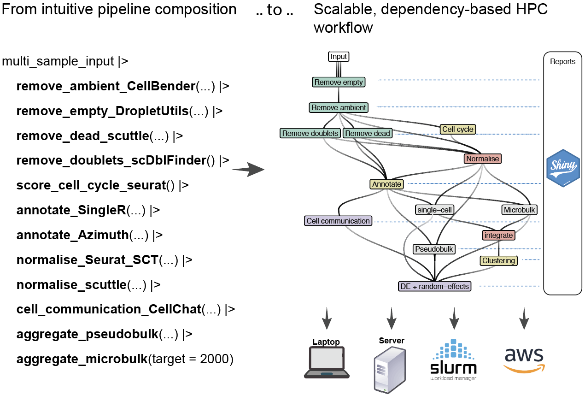

Simple to compose, but incredibly scalable single-cell/spatial pipelines.

HPCell is a grammar that allows to compose pipe-friendly single-cell and spatial pipelines, that are converted to fully integrated, dependency-based parallelised workflow, that can be easily deployed to HPC with no setup, and easily to cloud-computing.

```{r, echo=FALSE, out.width = "70%"}

```

The advent of advanced sequencing techniques, such as microfluidic, microwell, droplet-based methodologies, and spatial transcriptomics technologies, has significantly transformed the study of biological systems. These advancements have resulted in extensive human and mouse cell compendiums, necessitating scalable analysis pipelines for large-scale data. Single-cell RNA-seq pipelines, including Nextflow and Snakemake, provide robust solutions but require extensive customisation and scripting. Graphical workflow systems like Galaxy and KNIME, while user-friendly, often lack the scalability needed for large datasets. With tools like Bioconductor, Seurat, scater, and others, the R ecosystem offers comprehensive solutions for single-cell RNA sequencing analysis but faces limitations in parallelisation efficiency. The targets R ecosystem addresses these challenges by offering an integrated, high-performance, cloud-compatible solution that optimises computational resources and enhances workflow robustness. We introduce HPCell, a modular grammar based on tidy principles, utilising targets to parallelise single-cell and spatial R workflows efficiently. HPCell simplifies workflow management, improves scalability and reproducibility, and generates visual reports for enhanced data interpretability, significantly accelerating scientific discovery in the single-cell RNA sequencing community.

 The key features of HPCell include:

-   **Native R Pipeline:** HPCell is developed to work natively within the R environment, enhancing usability for R users without requiring them to learn new, workflow-specific languages.

-   **High Performance Computing Support:** HPCell supports scaling for large datasets and enables parallel processing of tasks on High Performance Computing platforms.

-   **Reproducibility and Consistency:** The framework ensures reproducibility and consistent execution environments through automatic dependency generation.

## Installation

```{r, eval=FALSE}

remote::install_github("stemangiola/HPCell")

```

## Pipeline  

```{r}

library(magrittr)
library(Seurat)
library(SeuratData)

options(Seurat.object.assay.version = "v5")
input_seurat <- 
  LoadData("pbmc3k") |>
  _[,1:500] 

file_path = tempfile()

input_seurat |> saveRDS(file_path)

# Let's pretend we have two samples
input_hpc =
  c(file_path, file_path) |> 
  magrittr::set_names(c("pbmc3k1_1", "pbmc3k1_2"))
```

Local parallel computing

`computing_resources = crew_controller_local(workers = 10)`

```{r, eval= FALSE}
library(HPCell)
library(crew)

input_hpc |> 
  
  # Initialise pipeline characteristics
  initialise_hpc(
    gene_nomenclature = "symbol",
    data_container_type = "seurat_rds",
    computing_resources = crew_controller_local(workers = 10) #resource_tuned_slurm
  ) |> 
  
  remove_empty_DropletUtils() |>          # Remove empty outliers
  remove_dead_scuttle() |>                # Remove dead cells
  score_cell_cycle_seurat() |>            # Score cell cycle
  remove_doublets_scDblFinder() |>        # Remove doublets
  annotate_cell_type() |>                 # Annotation
  normalise_abundance_seurat_SCT(factors_to_regress = c(
    "subsets_Mito_percent", 
    "subsets_Ribo_percent", 
    "G2M.Score"
  )) |> 
  calculate_pseudobulk(group_by = "monaco_first.labels.fine")

```

SLURM HPC parallel computing

`computing_resources =
      crew.cluster::crew_controller_slurm(
        slurm_memory_gigabytes_per_cpu = 5,
        workers = 50,
        tasks_max = 5,
        verbose = T
      )`

```{r, eval=FALSE}
library(HPCell)

input_hpc |> 
  
  # Initialise pipeline characteristics
  initialise_hpc(
    gene_nomenclature = "symbol",
    data_container_type = "seurat_rds",
    computing_resources =
      crew.cluster::crew_controller_slurm(
        slurm_memory_gigabytes_per_cpu = 5,
        workers = 50,
        tasks_max = 5,
        verbose = T
      )  ) |> 
  
  remove_empty_DropletUtils() |>          # Remove empty outliers
  remove_dead_scuttle() |>                # Remove dead cells
  score_cell_cycle_seurat() |>            # Score cell cycle
  remove_doublets_scDblFinder() |>        # Remove doublets
  annotate_cell_type() |>                 # Annotation
  normalise_abundance_seurat_SCT(factors_to_regress = c(
    "subsets_Mito_percent", 
    "subsets_Ribo_percent", 
    "G2M.Score"
  )) |> 
  calculate_pseudobulk(group_by = "monaco_first.labels.fine")

```

Optimised tiered SLURM HPC parallel computing. This is helpful when large scale analysis are performed on news, data sources, where there is a large difference difference between the smallest and the largest data set. with a tearing strategy, we can allocate the right resources, for example, memory, to the right samples, incredibly increasing the efficiency of the pipeline.

Beyond defining computing resources argument

`computing_resources = list(

    crew_controller_slurm(
      name = "tier_1",
      slurm_memory_gigabytes_per_cpu = 5,
      slurm_cpus_per_task = 1,
      workers = 50,
      tasks_max = 5,
      verbose = T
    ),
    crew_controller_slurm(
      name = "tier_2",
      slurm_memory_gigabytes_per_cpu = 10,
      slurm_cpus_per_task = 1,
      workers = 50,
      tasks_max = 5,
      verbose = T
    )
  )`
  
we to define a tiers argument. For example for two samples

`tier = c("tier_1", "tier_2")`

Where the name of the worker used is the same as the name of the tears used.

```{r, eval=FALSE}
library(HPCell)

input_hpc |> 
  
  # Initialise pipeline characteristics
  initialise_hpc(
    gene_nomenclature = "symbol",
    data_container_type = "seurat_rds",
    tier = c("tier_1", "tier_2"),
    computing_resources = list(
    crew_controller_slurm(
      name = "tier_1",
      slurm_memory_gigabytes_per_cpu = 5,
      slurm_cpus_per_task = 1,
      workers = 50,
      tasks_max = 5,
      verbose = T
    ),
    crew_controller_slurm(
      name = "tier_2",
      slurm_memory_gigabytes_per_cpu = 10,
      slurm_cpus_per_task = 1,
      workers = 50,
      tasks_max = 5,
      verbose = T
    )
  )  ) |> 
  
  remove_empty_DropletUtils() |>          # Remove empty outliers
  remove_dead_scuttle() |>                # Remove dead cells
  score_cell_cycle_seurat() |>            # Score cell cycle
  remove_doublets_scDblFinder() |>        # Remove doublets
  annotate_cell_type() |>                 # Annotation
  normalise_abundance_seurat_SCT(factors_to_regress = c(
    "subsets_Mito_percent", 
    "subsets_Ribo_percent", 
    "G2M.Score"
  )) |> 
  calculate_pseudobulk(group_by = "monaco_first.labels.fine")

```


# Documentation about the steps of the pipeline

## STEP 1: Filtering out empty droplets (function `empty_droplet_id`)

*Parameters* 
1. input_read_RNA_assay SingleCellExperiment object containing RNA assay data.
2. filter_empty_droplets Logical value indicating whether to filter the input data.

We filter empty droplets as they don't represent cells, but include only ambient RNA, which is uninformative for our biological analyses. 

Outputs `barcode_table` which is a tibble containing log probabilities, FDR, and a classification indicating whether cells are empty droplets.

This step includes 4 sub steps: Filtering mitochondrial and ribosomal genes, ranking droplets, identifying minimum threshold and removing cells with RNA counts below this threshold

```{r, eval=FALSE}
HPCell::empty_droplet_id(input_read, filter_empty_droplets)
```

### 1. Filtering mitochondrial and ribosomal genes based on EnsDb.Hsapiens.v8 reference dataset 

Mitochondrial and ribosomal genes exhibit expression patterns in single-cell RNA sequencing (scRNA-seq) data that are distinct from the patterns observed in the rest of the transcriptome. They are filtered out to improve the quality and interpretability of scRNA-seq data, focusing the analysis on genes more likely to yield insights

```{r, eval=FALSE}
 # Genes to exclude
location <- AnnotationDbi::mapIds(
  EnsDb.Hsapiens.v86,
  keys= BiocGenerics::rownames(input_read_RNA_assay),
  column="SEQNAME",
  keytype="SYMBOL"
  )
mitochondrial_genes = BiocGenerics::which(location=="MT") |> names()
ribosome_genes = BiocGenerics::rownames(input_read_RNA_assay) |> stringr::str_subset("^RPS|^RPL")
```

### 2. Ranking droplets 
From the one with highest amount of mRNA, to the lowest amount of mRNA. 
For this we use the function `barcodeRanks()`

```{r, eval=FALSE}
DropletUtils::barcodeRanks(GetAssayData(input_read_RNA_assay, assay, slot = "counts"))
```

### 3. Set min threshold 
A minimum threshold cutoff 'lower' is set to exclude cells with low RNA counts 
If the minimum total count is greater than 100, we exclude the bottom 5% of barcodes by count. 
Otherwise lower is set to 100. 

```{r, eval=FALSE}
if(min(barcode_ranks$total) < 100) { lower = 100 } else {
    lower = quantile(barcode_ranks$total, 0.05)}
```

### 4. Remove cells with low RNA counts 
(This step will not be executed if the filter_empty_droplets argument is set to FALSE, in which case all cells will be retained)
   
#### .cell column 
- The emptyDrops() function from dropletUtils is applied to the filtered data set with the lower bound set to 'lower' as defined earlier 
- True, non-empty cells are assigned to a column named '.cell' in the output tibble "barcode_table"
  
#### empty_droplet column 
- Column empty_droplet is added by flagging droplets as empty (empty_droplet = TRUE) if their False Discovery Rate (FDR) from the  mptyDrops test is equal to or greater than a specified significance threshold (in this case 0.001)
    
(Any droplets with missing data in the empty_droplet column are conservatively assumed to be empty.)

```{r, eval=FALSE}
significance_threshold = 0.001
... |> 
  DropletUtils::emptyDrops( test.ambient = TRUE, lower=lower) |>
  mutate(empty_droplet = FDR >= significance_threshold) 

  barcode_table <- ... |> 
  mutate( empty_droplet = FALSE)

```

### 5. Knee and inflection points are added to to barcode_table 
(to assisted with plotting barcode rank plot)

```{r, eval=FALSE}
barcode_table <- ... |> 
  mutate(
    knee =  metadata(barcode_ranks)$knee,
    inflection =  metadata(barcode_ranks)$inflection
    )
```

## STEP 2: Assign cell cycle scores based on expression of G2/M and S phase markers (function: `cell_cycle_scoring`)

*Parameters* 
1. input_read_RNA_assay: SingleCellExperiment object containing RNA assay data.
2. empty_droplets_tbl: A tibble identifying empty droplets.

This step includes 2 sub steps: Normalization and cell cycle scoring.  

Returns a tibble containing cell identifiers with their predicted classification into cell cycle phases: G2M, S, or G1 phase.

```{r, eval=FALSE}
HPCell::cell_cycle_scoring(input_read,
                   empty_droplets_tbl)
```

### 1. normalization:
Normalize the data using the `NormalizeData` function from Seurat to make the expression levels of genes across different cells more comparable

```{r, eval=FALSE}
 ...|>
  NormalizeData()
```

### 2. cell cycle scoring: 
Using the `CellCycleScoring` function to assign cell cycle scores of each cell based on its expression of G2/M and S phase markers.
Stores S and G2/M scores in object meta data along with predicted classification of each cell in either G2M, S or G1 phase
```{r, eval=FALSE}
 ...|> 
  Seurat::CellCycleScoring(  
    s.features = Seurat::cc.genes$s.genes,
    g2m.features = Seurat::cc.genes$g2m.genes,
    set.ident = FALSE 
    ) 
```

## STEP 3: Filtering dead cells (function `alive_identification`) 

*Parameters* 
1. input_read_RNA_assay: SingleCellExperiment object containing RNA assay data.
2. empty_droplets_tbl: A tibble identifying empty droplets.
3. annotation_label_transfer_tbl: A tibble with annotation label transfer data.

Filters out dead cells by analyzing mitochondrial and ribosomal gene expression percentages. 

Returns a tibble containing alive cells. 

This step includes 6 sub-steps: Identifying chromosomal location of each read, identifying mitochondrial genes, extracting raw `Assay` (e.g., RNA) count data, compute per-cell QC metrics, determine high mitochondrion content, identify cells with unusually high ribosomal content 

```{r, eval=FALSE}
HPCell::alive_identification(input_read,
                     empty_droplets_tbl,
                     annotation_label_transfer_tbl)
```

### 1. Identifying chromosomal location of each read: 
We retrieves the chromosome locations for genes based on their gene symbols. 
- The `mapIds` function from the `AnnotationDbi` package is used for mapping between different types of gene identifiers. 
- The `EnsDb.Hsapiens.v86` Ensembl database is used as the reference data set. 

```{r, eval=FALSE}
location <- AnnotationDbi::mapIds(
  EnsDb.Hsapiens.v86,
  keys=rownames(input_read_RNA_assay),
  column="SEQNAME",
  keytype="SYMBOL"
  )
```

### 2. identifying mitochondrial genes: 
Identify the mitochondrial genes based on their symbol (starting with "MT")

```{r, eval=FALSE}
which_mito = rownames(input_read_RNA_assay) |> stringr::str_which("^MT")
```

### 3. Extracting raw `Assay` (e.g., RNA) count data 
Raw count data from the the "RNA" assay is extracted using the `GetAssayData` function from `Seurat` and stored in the "rna_counts" variable. This extracted data can be used for further analysis such as normalization, scaling, identification of variable genes, etc., 

```{r, eval=FALSE}
rna_counts <- Seurat::GetAssayData(input_read_RNA_assay, layer = "counts", assay=assay)
```

### 4. Compute per-cell QC metrics 
Quality control metrics are calculated using the `perCellQCMetrics` function from the `scater` package. Metrics include sum of counts (library size), and the number of detected features. 

```{r, eval=FALSE}
qc_metrics <- scuttle::perCellQCMetrics(rna_counts, subsets=list(Mito=which_mito)) %>%
  dplyr::select(-sum, -detected)
```

### 5. Determine high mitochondrion content 
- High Mitochondrial content is identified by applying the `isOutlier` function from `scuttle` to the subsets_Mito_percent column. - Outliers are converted to a logical value: `TRUE` for outliers and `FALSE` for non-outliers. 
```{r, eval=FALSE}
mitochondrion <- ... |> 
  mutate(high_mitochondrion = scuttle::isOutlier(subsets_Mito_percent, type="higher"),
         high_mitochondrion = as.logical(high_mitochondrion))))

```

### 6. Identify cells with unusually high ribosomal content 
`PercentageFeatureSet` from `Seurat` is used to compute the proportion of counts corresponding to ribosomal genes
```{r, eval=FALSE}
subsets_Ribo_percent = Seurat::PercentageFeatureSet(input_read_RNA_assay,  pattern = "^RPS|^RPL", assay = assay
```

- High ribosomal content is identified by applying the the `isOutlier` function from `scuttle` to the subsets_Ribo_percent column. - The outlier stays is converted to a logical value: `TRUE` for outliers and `FALSE` for non-outliers. 
```{r, eval=FALSE}
ribosome = ... |> 
  mutate(high_ribosome = scuttle::isOutlier(subsets_Ribo_percent, type="higher")) |>
  mutate(high_ribosome = as.logical(high_ribosome)) 
```

## STEP 4 Identifying doublets (function: `doublet_identification`)
*Parameters*: 
1. input_read_RNA_assay `SingleCellExperiment` object containing RNA assay data.
2. `empty_droplets_tbl` A tibble identifying empty droplets.
3. `alive_identification_tbl` A tibble identifying alive cells.
4. `annotation_label_transfer_tbl` A tibble with annotation label transfer data.
5. `reference_label_fine` Optional reference label for fine-tuning.

Applies the `scDblFinder` algorithm to the filter_empty_droplets dataset. It supports integrating with
`SingleR` annotations if provided and outputs a tibble containing cells with their associated scDblFinder scores.

Returns a tibble containing cells with their `scDblFinder` scores

```{r, eval=FALSE}
HPCell::doublet_identification(input_read,
                               empty_droplets_tbl,
                               alive_identification_tbl,
                               annotation_label_transfer_tbl,
                               reference_label_fine)
```

The `scDblFinder` function from `scDblFinder` is used to detect doublets, which are cells originating from two or more cells being captured in the same droplet, in the scRNA-seq data. Doublets can skew analyses and lead to incorrect interpretations, so identifying and potentially removing them is important.

- In our current code, clustering is set to NULL. 
- Alternatively clustering can be dynamically be set to NULL if reference_label_fine == "none" and equal to reference_label_fine if it's provided. ( Clustering information could help identify outliers in clusters which may indicate doublets, or can simulate doublets based on clustering information )
```{r, eval=FALSE}
filter_empty_droplets <- ... |> 
  scDblFinder::scDblFinder(clusters = NULL) 
```

## STEP 5: Add annotation labelling to data set (function `annotation_label_transfer`)

*Parameters*
1. input_read_RNA_assay: `SingleCellExperiment` object containing RNA assay data.
2. empty_droplets_tbl: A tibble identifying empty droplets.
3. reference_azimuth: Optional reference data for Azimuth.

This step utilizes `SingleR` for cell-type identification using reference data sets
(Blueprint and Monaco Immune data). It can also perform cell type labeling using Azimuth when a reference is provided.

This step includes 3 sub steps: Filtering and normalisation, reference data loading, Cell Type Annotation with `MonacoImmuneData` for Fine and Coarse Labels and cell Type Annotation with `BlueprintEncodeData` for Fine or Coarse Labels

```{r, eval=FALSE}
HPCell::annotation_label_transfer(input_read,
                                  empty_droplets_tbl,
                                  reference_read)
```

### 1. Filtering and normalisation
- Cells flagged as empty_droplet are removed from the dataset using the `filter` function from dplyr.
-  `logNormCounts` is used to apply log-normalization to the count data. This helps to make the gene expression levels more comparable across cells. 

```{r, eval=FALSE}
sce = ... |> 
  dplyr::filter(!empty_droplet) |>
  scuttle::logNormCounts()
```

### 2. Reference data loading 
Load cell type reference data from `BlueprintEncodeData` and `MonacoImmuneData` provided by the `celldex` package for cell annotation based on gene expression profiles 

```{r, eval=FALSE}
blueprint <- celldex::BlueprintEncodeData()
MonacoImmuneData = celldex::MonacoImmuneData()
```

### 3. Cell Type Annotation with `MonacoImmuneData` for Fine and Coarse Labels 
(depending on the tissue type selected by the user)

- Performs cell type annotation using `SingleR` with the `MonacoImmuneData` reference with fine-grained cell type labels and coarse-grained labels 
- Creates column `blueprint_first.labels.fine` and `blueprint_first.labels.coarse` which contains scores on the likely cell type that each read belongs to

```{r, eval=FALSE}
data_annotated =
    SingleR::SingleR(
      ref = blueprint,
      assay.type.test= 1,
      labels = blueprint$label.fine
      ) |>
    rename(blueprint_first.labels.fine = labels) |>
  
  SingleR::SingleR(
    ref = blueprint,
    assay.type.test= 1,
    labels = blueprint$label.main
    ) |>
  as_tibble(rownames=".cell") |>
  nest(blueprint_scores_coarse = starts_with("score")) |>
  select(-one_of("delta.next"),- pruned.labels) |>
  rename( blueprint_first.labels.coarse = labels))
```

### 4.Cell Type Annotation with `BlueprintEncodeData` for Fine and Coarse Labels 
- Performs cell type annotation using `SingleR` with the `blueprint` reference with fine-grained cell type labels and coarse-grained labels. 
- Creates column monaco_first.labels.fine and monaco_first.labels.coarse which contains scores on the likely cell type that each read belongs to

```{r, eval=FALSE}
data_annotated = ... |> 
  sce |>
  SingleR::SingleR(
    ref = MonacoImmuneData,
    assay.type.test= 1,
    labels = MonacoImmuneData$label.fine
    )  
      
    ... |>
      SingleR::SingleR(
        ref = MonacoImmuneData,
        assay.type.test = 1,
        labels = MonacoImmuneData$label.main
        ) 
```

## STEP 6 Data normalisation (function: `non_batch_variation_removal`)
Regressing out variations due to mitochondrial content, ribosomal content, and 
cell cycle effects.

*Parameters* 
1. `input_read_RNA_assay` Path to demultiplexed data.
2. `empty_droplets_tbl` Path to empty droplets data.
3. `alive_identification_tbl` A tibble from alive cell identification.
4. `cell_cycle_score_tbl` A tibble from cell cycle scoring.

Returns normalized and adjusted data

This step includes 3 sub-steps: Construction of `counts` data frame, data normalization with `SCTransform` and normalization with `NormalizeData`
```{r, eval=FALSE}
 HPCell::non_batch_variation_removal(input_read,
                                     empty_droplets_tbl,
                                     alive_identification_tbl,
                                     cell_cycle_score_tbl)
```

### 1. Construction of `counts` data frame: 
We construct the `counts` data frame by aggregating outputs from empty_droplets_tbl, alive_identification_tbl and cell_cycle_score_tbl. 
- We exclude empty droplets from initial raw count data. 
- Next we incorporate ribosomal and mitochondrial percentages which offer insights into cellular health and metabolic activity 
- Finally we add cell cycle G2/M score to each cell's profile. 

```{r, eval=FALSE}
counts = ... |> 
  left_join(empty_droplets_tbl, by = ".cell") |>
  dplyr::filter(!empty_droplet) |>
  left_join(
    HPCell::alive_identification_tbl |>
      select(.cell, subsets_Ribo_percent, subsets_Mito_percent),
    by=".cell"
    ) |>
  left_join(
    cell_cycle_score_tbl |>
      select(.cell, G2M.Score),
    by=".cell"
    )
```

### 2. Data normalization with `SCTransform`: 
We apply the `SCTransform` function to apply variance-stabilizing transformation (VST) to `counts` which normalizes and scales the data and also performs feature selection and controls for confounding factors. This results in data that is better suited for downstream analysis such as dimensionality reduction and differential expression analysis. 

```{r, eval=FALSE}
normalized_rna <- Seurat::SCTransform(
    counts, 
    assay=assay,
    return.only.var.genes=FALSE,
    residual.features = NULL,
    vars.to.regress = c("subsets_Mito_percent", "subsets_Ribo_percent", "G2M.Score"),
    vst.flavor = "v2",
    scale_factor=2186
  )
```

### 3. Normalization with `NormalizeData`: 
If the `ADT` assay is present, we further normalize our `counts` data using the centered log ratio (CLR) normalization method. This mitigates the effects of varying total protein expression across cells. If the `ADT` assay is absent, we can simply omit this step. 

```{r, eval=FALSE}
# If "ADT" assay is present
... |> 
  Seurat::NormalizeData(normalization.method = 'CLR', margin = 2, assay="ADT") 
```

## STEP 7 Creating individual pseudo bulk samples (function: `create_pseudobulk`)
*Parameters*
1. pre-processing_output_S: Processed dataset from preprocessing
2. assays: assay used, default = "RNA" 
3. x: User defined character vector for c(Tissue, Cell_type_in_each_tissue)

- Aggregates cells based on sample and cell type annotations, creating pseudobulk samples 
for each combination. Handles RNA and ADT assays. 

- Returns a list containing pseudo bulk data aggregated by sample and by both sample and cell type. 

```{r, eval=FALSE}
HPCell::create_pseudobulk(preprocessing_output_S,   assays = "RNA",  x = c(Tissue, Cell_type_in_each_tissue))
```

We apply some data manipulation steps to get unique feature because RNA and ADT both can have similarly named genes. 
In our data set we may contain information on both RNA and ADT assays: 
- RNA: Measures the abundance of RNA molecules for different genes within a cell.
- ADT: Quantifies protein levels on the cell surface using antibodies tagged with DNA bar codes, which are then detected alongside RNA.

The challenge arises because both RNA and ADT data might include identifiers (gene names for RNA, protein names for ADT) that could be the same or very similar. However, they represent different types of biological molecules (nucleic acids vs. proteins). To accurately analyze and distinguish between these two data types in a combined data set, we need to ensure that each feature (whether it's an RNA-measured gene or an ADT-measured protein) has a unique identifier. Thus we apply these data manipulation steps: 

### 1.Cell aggregation by tissue and cell type
Cells are aggregated based on the `Tissue` and `Cell_type_in_each_tissue` columns. By summarizing single-cell data into groups, it mimics traditional bulk RNA-seq data while retaining the ability to dissect biological variability at a finer resolution

```{r, eval=FALSE}
# Aggregate cells
... |> 
  tidySingleCellExperiment::aggregate_cells(!!x, slot = "data", assays=assays) 
```


## High-performance single-cell, pseudobulk random-effect modelling

### One datasets/cell-type

The interface is intuitive and consistent with `tidybulk` `test_differential_abundance()`. By default `HPCell` uses `test_differential_abundance(..., method = "glmmSeq_lme4")`

<!-- ```{r} -->

<!-- # Setup your job submission system -->
<!-- slurm = crew.cluster::crew_controller_slurm( -->
<!--   name = "slurm", -->
<!--   slurm_memory_gigabytes_per_cpu = 5, -->
<!--   slurm_cpus_per_task = 1, -->
<!--   workers = 200, -->
<!--   verbose = T -->
<!-- ) -->
<!-- # Perform the analyses.  -->
<!-- tidySummarizedExperiment::se |> -->
<!--   keep_abundant(factor_of_interest = dex) |> -->

<!--   # Spread the workload onto 200 workers and collects the results seamlessly -->
<!--   test_differential_abundance_hpc( -->
<!--     ~ dex + (1 | cell) -->
<!--   ) -->
<!-- ``` -->


### Many datasets/cell-types

Sometime we do pseudobulk analyses for each cell type. HPCell allows to scale all those, in a coherent paralleisation to the HPC.

This would be the input dataset

```{r, eval=FALSE}

# A tibble: 22 × 3
   cell_type_harmonised data            formula  
   <chr>                <list>          <list>   
 1 b memory             <SmmrzdEx[,35]> <formula>
 2 b naive              <SmmrzdEx[,35]> <formula>
 3 plasma               <SmmrzdEx[,35]> <formula>
 4 ilc                  <SmmrzdEx[,38]> <formula>
 5 cd4 th1              <SmmrzdEx[,37]> <formula>
 6 cd4 th2              <SmmrzdEx[,40]> <formula>
 7 mait                 <SmmrzdEx[,26]> <formula>
 8 cd8 naive            <SmmrzdEx[,28]> <formula>
 9 cd8 tcm              <SmmrzdEx[,36]> <formula>
10 macrophage           <SmmrzdEx[,21]> <formula>
# ℹ 12 more rows
# ℹ Use `print(n = ...)` to see more rows

```

And here the call to the `map` version of `test_differential_abundance_hpc`

```{r, eval=FALSE}
nested_se |>
      mutate(data = map2_test_differential_abundance_hpc(
        data,
        formula ,
        computing_resources = slurm
      ))
```

This is the output 

```{r, eval=FALSE}
# A tibble: 22 × 3
   cell_type_harmonised data            formula  
   <chr>                <list>          <list>   
 1 b memory             <SmmrzdEx[,35]> <formula>
 2 b naive              <SmmrzdEx[,35]> <formula>
 3 plasma               <SmmrzdEx[,35]> <formula>
 4 ilc                  <SmmrzdEx[,38]> <formula>
 5 cd4 th1              <SmmrzdEx[,37]> <formula>
 6 cd4 th2              <SmmrzdEx[,40]> <formula>
 7 mait                 <SmmrzdEx[,26]> <formula>
 8 cd8 naive            <SmmrzdEx[,28]> <formula>
 9 cd8 tcm              <SmmrzdEx[,36]> <formula>
10 macrophage           <SmmrzdEx[,21]> <formula>
# ℹ 12 more rows
# ℹ Use `print(n = ...)` to see more rows
```


